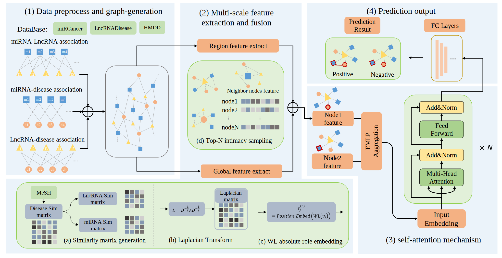

# BertNDA
BertNDA: Predicting associations of miRNAs,lncRNAs and diseases based on Graph-Bert and Multi-scale feature extraction
 


## Introduction:
In this work, we propose a predictive framework, called BertNDA, which aims to predict miRNA-lncRNA interactions related to diseases. The framework employs Laplace transform of graph structure and WL(Weisfeiler-Lehman) absolute role coding to extract global information, construct a connectionless subgraph to aggregate neighbor features, and identify local information. Moreover, an EMLP structure is adopted to obtain the multi-scale feature representation of nodes, which captures diverse information from different parts of the network. Furtherly, nodes are encoded using Transformer-encoder structure, and prediction-layer outputs the final correlation between miRNA-lncRNA and diseases. A 5-fold cross-validation further demonstrate that BertNDA outperforms the state-of-the-art method in predicting assignment. Overall, our model provides an efficient, accurate, and comprehensive tool for predicting ncRNA-disease associations, which can make a contribution in future study of disease. 

## Installation:

### Requirements:
All the codes are tested in the following environment:

```Linux (tested on Ubuntu 18.04)```, 
```Python 3.8.16```
```PyTorch 1.10.1```
```numpy 1.23.5```
```Pillow 8.3.2```

a. Install the dependent python libraries.
```shell
pip install -r requirements.txt 
```

### Dataset Preparation
The dataset deafult used in our code is "dataset1", if you want to train in the dataset2, please prepare the data in the following steps:
```shell
run main.py --dataset_sort=dataset2
```
some files will be generated in the dataset2 fold, follows as:
```
dataset2
├── sim_matrix.csv
├── negative_ij.npy
├── positive_ij.npy
├── subgraph_index.npy
├── WL.npy
```
If you want to transfer our model to your dataset, please prepaer the dataset as follows:
```
your_dataset
├── adjmatrix(m_l_d).csv
├── mir.txt
├── lnc.txt
├── dis.txt
```
then running our `main.py` to train the model in your datasets.

## online-platform:
we also a website to show the predict result in user-friendly, click [online-platform](39.106.16.168:8017) for details.

## Others:
### The Methods compared in our work
- CNNMDA: A novel based on CNN-based framework for predicting the associations between miRNA and dieases. paper url:[https://pubmed.ncbi.nlm.nih.gov/30977780/](https://pubmed.ncbi.nlm.nih.gov/30977780/)
- DEFLMDA: A model employs a novel computational approach of random forest ensemble learning to predict miRNA-disease associations, integrating autoencoders for low-dimensional feature representation. Paper url:[https://pubmed.ncbi.nlm.nih.gov/35325038/](https://pubmed.ncbi.nlm.nih.gov/35325038/)
- HGCNMDA: A model incorporates a gene layer in constructing a heterogeneous network. The model refines the feature of nodes into initial features and induction features and then learns miRNA and disease embeddings via a multi-graph convolutional network model. Paper url:[https://pubmed.ncbi.nlm.nih.gov/35776822/](https://pubmed.ncbi.nlm.nih.gov/35776822/)
- LDAformer: A model leverages topological feature extraction and Transformer encoder. Specifically, a pivotal process is designed for extracting potential multi-hop path feature from adjacent matrices during the topological information extraction stage. Paper url:[https://pubmed.ncbi.nlm.nih.gov/36094081/](https://pubmed.ncbi.nlm.nih.gov/36094081/)
- PADLMHOOI: A model implements high-order orthogonal iterations to predict potential associations and evaluates predictive performance through global and local leave-one-out cross-validation.Paper url:[https://pubmed.ncbi.nlm.nih.gov/31191710/](https://pubmed.ncbi.nlm.nih.gov/31191710/)

If you have any questions, welcome to contact with us at 2193612777@stu.xjtu.edu.cn!


